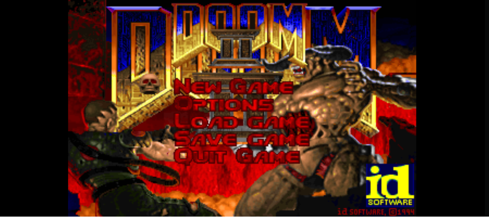

# LinuxDoom+
LinuxDoom+ is a source port based on LinuxDoom v1.10, it is aimed at vanilla compatibility while adding new features
# Credits
Fork of idSoftware/DOOM (linuxdoom-1.10), uses renderer and sound code by Sam Lantinga (modified and copied from SDLDoom!)
# Compiling
## NOTE: This code only compiles on Linux, a Windows build is not planned for now
You need to have nsl and sdl12-compat, you can install these in whatever linux distro you have,
Example: on Arch Linux
```sudo pacman -S sdl12-compat libnsl```
Then, clone the repository, and type
```make```
The output will be in the ```linux/``` folder
# Bugs
Game crashes when trying to quit multiple times
Sample rate is predefined as 11,205 Hz so some sounds that have 11,205 Hz (like the super shotgun reload) play at half speed
No music
# Screenshots

# TODO
Fix all bugs previously mentioned.
Windows port (that is up to you contributors, I have tried myself and failed)
